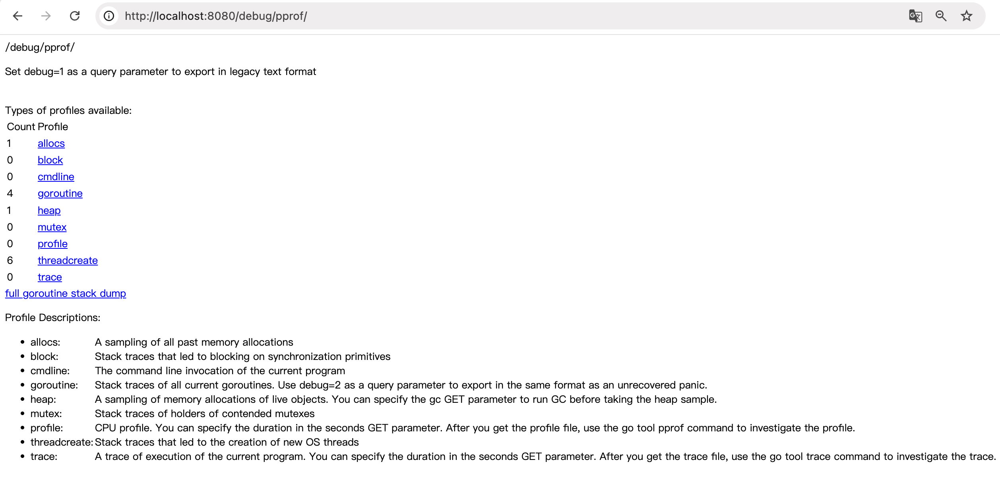
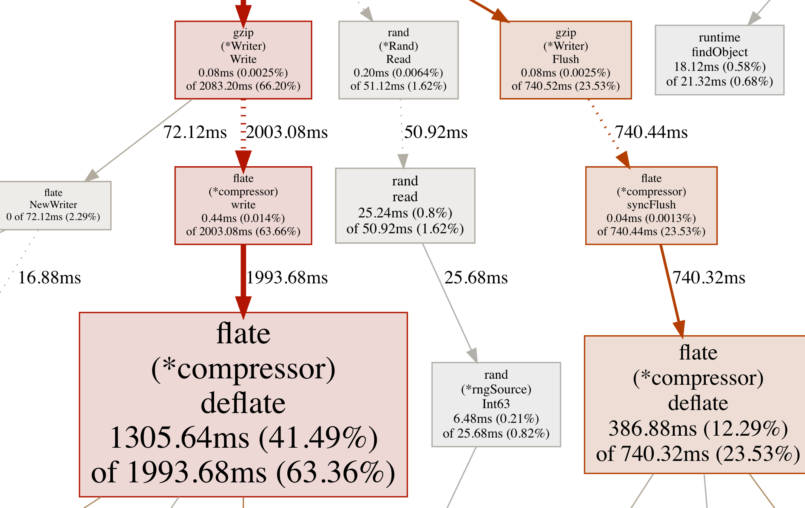
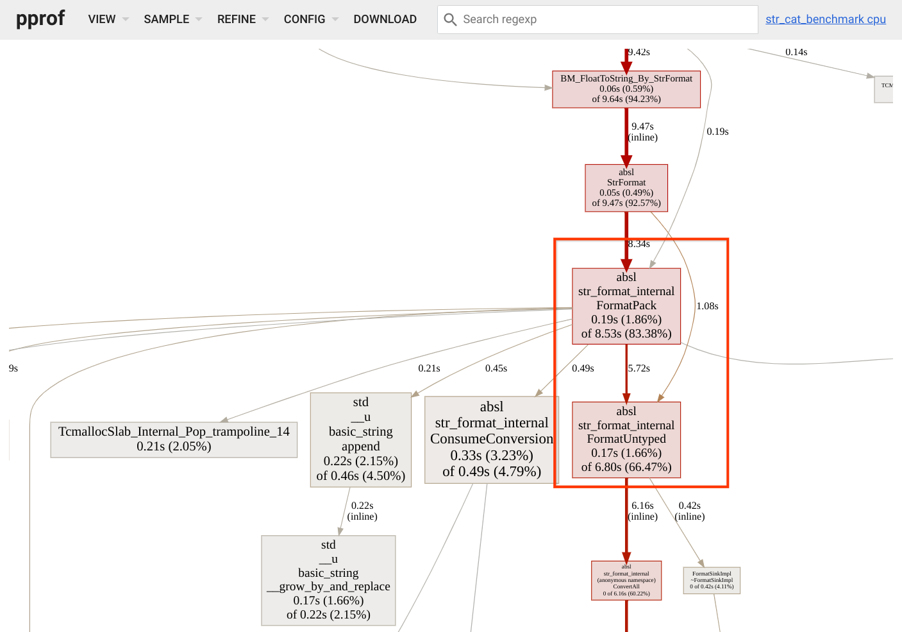
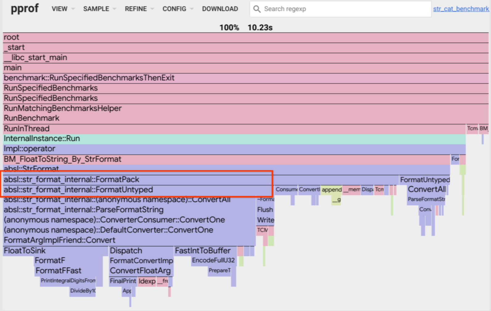
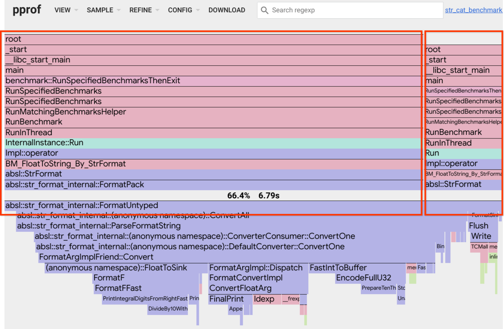
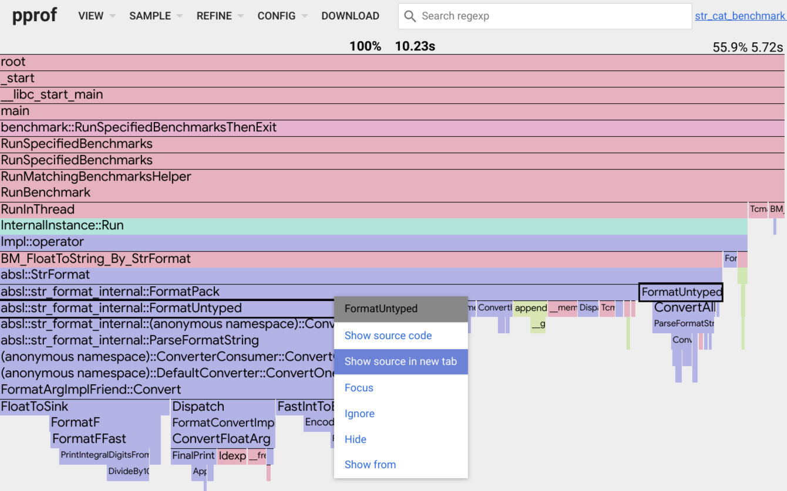
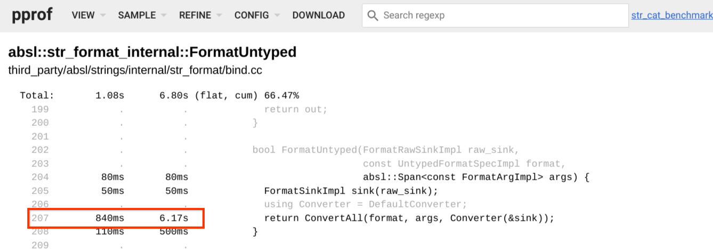
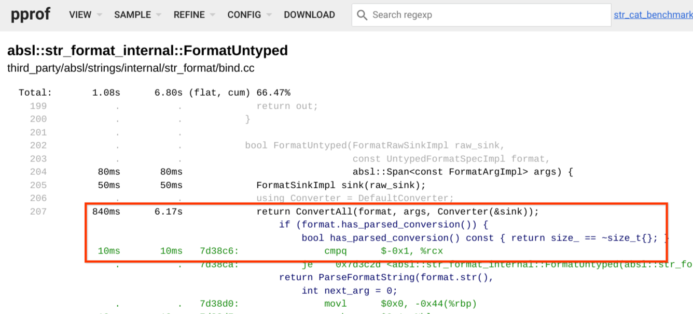
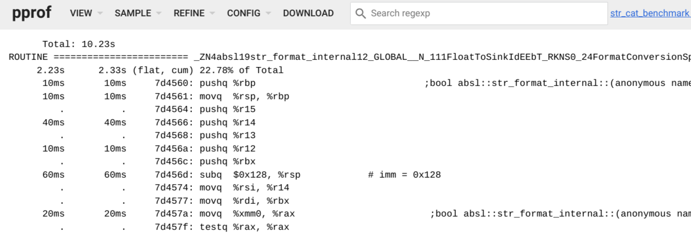
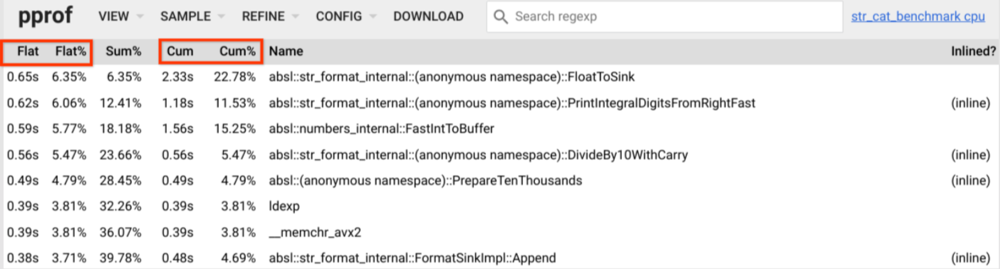

# PProf 使用手册

pprof 是 Google 官方提供的对 profiling 数据进行可视化和分析的工具。

本文更多的是概念性的解释，如果想看官方说明或快速入门，可以跳转至：
- 官方说明：[https://github.com/Google/pprof](https://github.com/Google/pprof)
- 快速入门： [https://github.com/wolfogre/go-pprof-practice](https://github.com/wolfogre/go-pprof-practice)

## 了解 profiling 

在软件工程中，profiling (“profile”, “program profiling”, “software profiling”) 指的是一种动态的程序分析形式，用于测量程序的内存空间、时间复杂度、特定指令的使用情况或函数调用的频率和持续时间。最常见的是，profiling 数据用于帮助程序优化，更确切地说，是性能优化工程。

通常来说，profiling 数据是通过某种工具在程序运行期间定时采集，包括不限于：内存、CPU、堆栈信息和函数调用等。

Go 中的 profiling 数据的类型和结构是通过 `profile.proto` 文件定义的。

>`profile.proto` 文件定义了性能数据的类型和结构，例如：
> - 程序的调用栈（Call Stack）
> - 采样样本（Sample）
> - 符号信息（例如函数名、文件名、行号等）
> - 标签（Label）和其他元数据
## pprof 与 profiling 的关系

pprof 扮演着两个角色，一个是采集 profiling 数据，一个是分析 profiling 数据。
### 采集 profiling 数据

Go 中是通过 build-in 的 pprof 包采集 profiling 数据的，有下面两种方式：

- `runtime/pprof`：pprof 采集的具体实现。
- `net/http/pprof`：将 `runtime/pprof` 简单封装为 http 服务

#### 使用 `runtime/pprof` 包编程采集

这个包是 pprof 的具体实现，可以通过编程的方式，手动控制采集哪些数据、何时开始采集、何时停止采集，例如下面采集 CPU 的使用情况：

```go
package main  
  
import (  
    "flag"  
    "log"  
    "os"   
    "os/signal"   
    "runtime"   
    "runtime/pprof"   
    "syscall")  
  
var cpuprofile = flag.String("cpuprofile", "", "write cpu profile to `file`")  
var memprofile = flag.String("memprofile", "", "write memory profile to `file`")  
  
func main() {  
   flag.Parse()  
  
   // 采集 cpu 数据  
   if *cpuprofile != "" {  
      f, err := os.Create(*cpuprofile)  
      if err != nil {  
         log.Fatal("could not create CPU profile: ", err)  
      }  
      defer f.Close() // error handling omitted for example  
      if err := pprof.StartCPUProfile(f); err != nil {  
         log.Fatal("could not start CPU profile: ", err)  
      }  
      // 没有正常关闭的话，采集的数据不会被写入文件  
      defer pprof.StopCPUProfile()  
   }  
  
   // 采集内存数据  
   if *memprofile != "" {  
      f, err := os.Create(*memprofile)  
      if err != nil {  
         log.Fatal("could not create memory profile: ", err)  
      }  
      defer f.Close() // 例如省略错误处理  
      runtime.GC()    // 获取最新的统计信息  
      if err := pprof.WriteHeapProfile(f); err != nil {  
         log.Fatal("could not write memory profile: ", err)  
      }  
   }  
  
   // ...程序的其余部分...  
   go func() {  
      for {  
         _ = make([]byte, 1024*1024) // 不断分配1MB的内存，模拟内存泄漏  
      }  
   }()  
  
   sigs := make(chan os.Signal, 1)  
   signal.Notify(sigs, syscall.SIGINT, syscall.SIGTERM)  
   <-sigs  
}
```

可以使用以下命令，将采集的结果存入文件：

```shell
go run main.go -cpuprofile cpu.prof -memprofile mem.prof
```

#### 使用 `net/http/pprof` 包自动采集

该包是对 `runtime/pprof` 包进行简单的封装，并将采集的结果通过 http 协议在端口上暴露出来：

```go
package main

import (
    _ "net/http/pprof" // 导入 pprof HTTP 包
    "net/http"
    "log"
)

func main() {
    // 启动 HTTP 服务器，pprof 端点将在 "/debug/pprof/" 路径下可用
    http.ListenAndServe(":8080", nil)

    // 主程序持续运行，以便 HTTP 服务器保持活动状态
    select {}
}
```

在这个例子中，程序启动了一个 HTTP 服务器，pprof 的性能数据可以通过访问 `http://localhost:8080/debug/pprof/` 来获取。最直观的可以打开浏览器访问该地址，即可看到采集到的各种分析数据：



**下载 profiling 数据：** 当线上服务出现异常现象时，常常需要立即将 profiling 数据下载到本地，这样可以避免服务异常重启导致 profiling 数据丢失，然后再进行后续的分析。可以通过 curl 命令下载上面的各种数据，例如下载 goroutine 数据，可以执行 `curl http://localhost:8080/debug/pprof/goroutine -o goroutine.prof`。
### 分析 profiling 数据

pprof 是读取一组 profile.proto 格式的 profiling 数据，然后生成报告来帮助可视化分析数据。报告既可以是纯文本，也可以是图形化的。

基于上面采集到的 profiling 数据，可以使用 pprof 工具进行分析：

```shell
go tool pprof [source]
```

这里的 source 可以是：

- profiling 数据文件：`go tool pprof goroutine.prof`
- http 地址：`go tool pprof http://localhost:8080/debug/pprof/goroutine`

相同类型的多个 profiling 数据可以被聚合或比较。

## 使用方式

pprof 分析数据有三种使用方式。
### 生成报告

可以直接使用命令生成一份指定格式的报告：

```shell
go tool pprof <format> [options] <source>
```

通过  `go tool pprof -h` 可以查看支持哪些 format：

```text
 Output formats (select at most one):
    -callgrind       Outputs a graph in callgrind format
    -comments        Output all profile comments
    -disasm          Output assembly listings annotated with samples
    -dot             Outputs a graph in DOT format
    -eog             Visualize graph through eog
    -evince          Visualize graph through evince
    -gif             Outputs a graph image in GIF format
    -gv              Visualize graph through gv
    -kcachegrind     Visualize report in KCachegrind
    -list            Output annotated source for functions matching regexp
    -pdf             Outputs a graph in PDF format
    -peek            Output callers/callees of functions matching regexp
    -png             Outputs a graph image in PNG format
    -proto           Outputs the profile in compressed protobuf format
    -ps              Outputs a graph in PS format
    -raw             Outputs a text representation of the raw profile
    -svg             Outputs a graph in SVG format
    -tags            Outputs all tags in the profile
    -text            Outputs top entries in text form
    -top             Outputs top entries in text form
    -topproto        Outputs top entries in compressed protobuf format
    -traces          Outputs all profile samples in text form
    -tree            Outputs a text rendering of call graph
    -web             Visualize graph through web browser
    -weblist         Display annotated source in a web browser
```

例如执行以下命令，可以看到当前文件夹下生成了一份 pdf 报告：

```
go tool pprof -pdf cpu.prof
```

### 终端交互

如果在命令中不指定 format，将自动开启命令行交互功能：

```
go tool pprof [options] source
```

这将开启一个交互式的 shell，用户可以在这里输入一些指令。可以输入 `help` 来获取帮助。

通常步骤是：
1. 使用 top 命令显示 top n 条耗资源的函数

```text
$ go tool pprof cpu.prof
File: wenchangchain-native
Build ID: 0dfea2918afee11535adf613f4af664d899e4126
Type: cpu
Time: Aug 22, 2024 at 1:39pm (CST)
Duration: 30.10s, Total samples = 92.54s (307.44%)
Entering interactive mode (type "help" for commands, "o" for options)
(pprof) top 5
Showing nodes accounting for 80.69s, 87.19% of 92.54s total
Dropped 37 nodes (cum <= 0.46s)
Showing top 5 nodes out of 18
      flat  flat%   sum%        cum   cum%
    37.36s 40.37% 40.37%     59.76s 64.58%  runtime.lock2
    13.88s 15.00% 55.37%     13.88s 15.00%  runtime.procyield
    12.46s 13.46% 68.84%     89.48s 96.69%  runtime.chanrecv
    10.40s 11.24% 80.07%     15.09s 16.31%  runtime.unlock2
     6.59s  7.12% 87.19%      6.59s  7.12%  runtime.osyield
```

3. 使用 list 命令查看指定函数的源代码，这会在特定的行显示 flat 和 cum 时间。

```text
(pprof) list runtime.lock2
Total: 92.54s
ROUTINE ======================== runtime.lock2 in /usr/local/go/src/runtime/lock_futex.go
    37.36s     59.76s (flat, cum) 64.58% of Total
         .          .     46:
         .          .     47:func lock(l *mutex) {
         .          .     48:	lockWithRank(l, getLockRank(l))
         .          .     49:}
         .          .     50:
     730ms      730ms     51:func lock2(l *mutex) {
     120ms      120ms     52:	gp := getg()
         .          .     53:
     120ms      120ms     54:	if gp.m.locks < 0 {
         .          .     55:		throw("runtime·lock: lock count")
         .          .     56:	}
     150ms      150ms     57:	gp.m.locks++
         .          .     58:
         .          .     59:	// Speculative grab for lock.
      10ms       10ms     60:	v := atomic.Xchg(key32(&l.key), mutex_locked)
    20.26s     20.26s     61:	if v == mutex_unlocked {
     200ms      200ms     62:		return
         .          .     63:	}
```


### Web 交互

如果像下面这样，指定 host:port：

```
pprof -http=[host]:[port] [options] source
```

pprof 将在指定端口启动处理 http 请求的服务。在浏览器访问 `http://<host>:<port>/` 即可看到交互界面。
## 报告解释

pprof 的目标是为 profile 数据生成报告。而这个报告是根据位置层次结构生成的，也就是说生成的是一个具有层次结构、展现调用关系的报告，其中每个层次的位置节点都包含两个数值：

- flat：该位置本身执行直接消耗的资源（CPU、内存等）。例如：一个函数除去调用其他函数的耗时，剩余的自身执行任务直接消耗的时间。
- cum：该位置及其所有子函数（即调用其他函数）执行所消耗的总资源。例如：一个函数执行的总耗时。

这里着重说一下图形化报告。

### 图形化报告

pprof 可以生成 DOT 格式的图形化报告，同时可以使用 graphviz 将其转换为其他各种图形化的格式。

- **-dot:** Generates a report in .dot format. All other formats are generated from this one.
- **-svg:** Generates a report in SVG format.
- **-web:** Generates a report in SVG format on a temp file, and starts a web browser to view it.
- **-png, -jpg, -gif, -pdf:** Generates a report in these formats.

这些图形化的报告展现了程序执行时内部函数的调用关系，同时有些无关紧要的节点被适当裁剪掉了，以控制报告中展现的节点数量。

#### 解释 callgraph

- 节点的颜色：
	- 红色：cum 值是大正数
	- 绿色：cum 值是大负数；负数通常出现在  profile 比对时，详情见：[比对profiles](#比对profiles)。
	- 灰色：cum 值接近 0
- 节点内字体的大小：
	- 大字：flat 值很大
	- 小字：flat 值很小
- 线的粗细：
	- 粗：该路径上消耗较多的资源
	- 细：该路径上消耗较少的资源
- 线的颜色：
	- 红色：大正数
	- 绿色：大负数
	- 灰色：接近 0
- 虚线：说明这俩节点间是间接调用，之间的一些无关紧要的节点被裁剪掉了。
- 实线：说明这俩节点间是直接调用。
- `inline` 标识：说明该调用被内联到了调用者里。

以下面的图形化报告为例：



- 对于节点：
	- (\*Rand).Read 有一个较小的 flat 值和一个较小的 cum 值，因为字体小且节点是灰色的。
	- (\*compressor).deflate 有一个较大的 flat 值和一个较大的 cum 值，因为字体大且节点是红色的。
	- (\*Writer).Flush 有一个较小的 flat 值和一个较大的 cum 值，因为字体小但节点是红色的。
- 对于边：
	- (\*Writer).Write 和 (\*compressor).write 之间的边：
		- 由于它是一条虚线边，这两个之间移除了一些节点。
		- 由于它粗且红色，这两个节点之间的调用栈使用了更多资源。
	- (\*Rand).Read 和 read 之间的边：
		- 由于它是一条虚线边，这两个之间移除了一些节点。
		- 由于它细且灰色，这两个节点之间的调用栈使用了较少资源。
	- read 和 (\*rngSource).Int63 之间的边：
		- 由于它是一条实线边，这两个之间没有节点（即它是直接调用）。  
		- 由于它细且灰色，这两个节点之间的调用栈使用了较少资源。


## Web 交互

当通过 web 界面交互（在命令中增加选项 `-http=[host]:[port]`），pprof 会在指定端口开启一个 web 站点，在浏览器通过与该界面交互，可以观察各种格式的 profile 数据。

### Views

显示器的顶部是一个包含一些按钮和菜单的标题。View 菜单允许用户在配置文件的不同可视化之间切换。现提供的意见如下:
#### Graph

这是默认展示的格式，其中节点代表函数，线代表调用关系。



例如：`FormatPack` 输出线指向 `FormatUntype`，表明前者调用后者。沿线的数字(5.72 s)表示 `FormatPack` 调用 `FormatUntype` 花费的时间。

#### Flame Graph

切换到 `View/Flame graph`，将展示一个[火焰图](https://www.brendangregg.com/flamegraphs.html)。该图表示出了调用者/被调用者间紧凑的关系：



该图中的框对应函数之间的调用栈。caller 框位于 callee 框的正上方。每个框的宽度与 profile 数据文件中该位置的采样值的大小成正比。每个框下面的子框是从左向右按值从大到小排列的。

例如，这里我们看到 `FormatPack` 正好位于 `FormatUntype` 之上，这表明前者调用后者。`FormatUntype` 的宽度对应于此调用占用的时间分数。


**查看 callers**

pprof 的火焰图扩展了传统的模型: 当一个函数被点击时，图会筛选出所有调用了该函数的堆栈数据。因此，单击任何 `FormatUntype` 框都会显示最终调用了 `FormatUntype` 的堆栈信息:



####  Annotated Source Code

右击函数 `FormatUntype` ，可以看到有些可选项：



选择 `Show source in new tab`，这将在新的标签页展示该函数被适当注释后的源代码。



上面的源代码中，每行有两个值：
- 第一个值：当前行直接执行的时间。
- 第二个值：当前行及其所调用的函数的总执行时间。

点击 207 行，就会展开其中包括的内联代码（蓝色）和汇编代码（绿色）：

> 1. **内联函数调用的源代码**：在某些情况下，编译器会将函数调用的代码直接插入到调用点，而不是在执行时跳转到函数的独立代码块。这种做法称为内联（inlining），它可以减少函数调用的开销，但会导致源代码的膨胀。
> 2. **对应的汇编代码**：汇编代码是源代码的低级表示，它更接近于计算机实际执行的机器指令。通过查看汇编代码，开发者可以了解程序在硬件层面上是如何执行的，包括寄存器的使用、内存访问等细节。



这样的深入分析有助于开发者理解代码在底层是如何执行的，以及如何可能影响程序的性能。通过这种方式，开发者可以更精确地定位性能瓶颈，理解代码的执行流程，以及做出相应的优化。这对于编写高效的程序代码非常重要。

#### Disassembly

有时，只按指令顺序查看反汇编而不与源代码交错是有帮助的。您可以通过`View/Disassembly`来实现这一点。


#### Top Functions

有时，您可能会发现仅显示配置文件中顶部函数的表格很有帮助：



该表显示了两个指标：

- flat：该位置本身执行直接消耗的资源（CPU、内存等）。例如：一个函数除去调用其他函数的耗时，剩余的自身执行任务直接消耗的时间。
- cum：该位置及其所有子函数（即调用其他函数）执行所消耗的总资源。例如：一个函数执行的总耗时。

该表最初按照 Flat 的递减排序，单击 Cum 表头将按其递减排序。
#### Peek

此视图以简单的文本格式显示每个函数的调用方/调用方。火焰图形视图通常更有帮助。

## 比对profiles

假设我们有一个Web服务器，我们对其性能进行了两次分析，生成了两个性能分析文件：`profile1` 和 `profile2`。

1. **使用 `-diff_base` 选项**：
    
    - 假设我们想要比较 `profile2` 相对于 `profile1` 的变化。
    - 我们运行 `go tool pprof -diff_base=profile1 profile2`。
    - `pprof` 会显示 `profile2` 中每个样本的值与 `profile1` 中相应样本的值之间的差异。
    - 如果 `profile2` 中某个函数的CPU时间比 `profile1` 多了，那么这个函数在报告中的 `flat` 值会是正值；如果少了，就会是负值。
    - 输出中的百分比是相对于 `profile1` 的样本总数来计算的，这有助于我们了解变化的规模。
2. **使用 `-base` 选项**：
    
    - 假设我们在优化了Web服务器后，收集了 `profile2`，并想要了解优化前后的整体性能变化。
    - 我们运行 `go tool pprof -base=profile1 profile2`。
    - `pprof` 会从 `profile2` 中减去 `profile1`，但只显示正值，即优化带来的性能提升。
    - 比如，如果 `profile1` 显示服务器处理请求的总CPU时间是100秒，而 `profile2` 是90秒，那么 `pprof` 会显示减少的10秒。
    - 输出中的百分比是相对于 `profile1` 和 `profile2` 样本总数之差来计算的，这有助于我们了解优化的效果。

简而言之，`-diff_base` 用于显示两个性能分析文件之间的差异，可能会有负值，而 `-base` 用于分析性能改进，只显示正值。两者都是比较性能分析文件的工具，但适用的场景和输出的解释方式不同。
