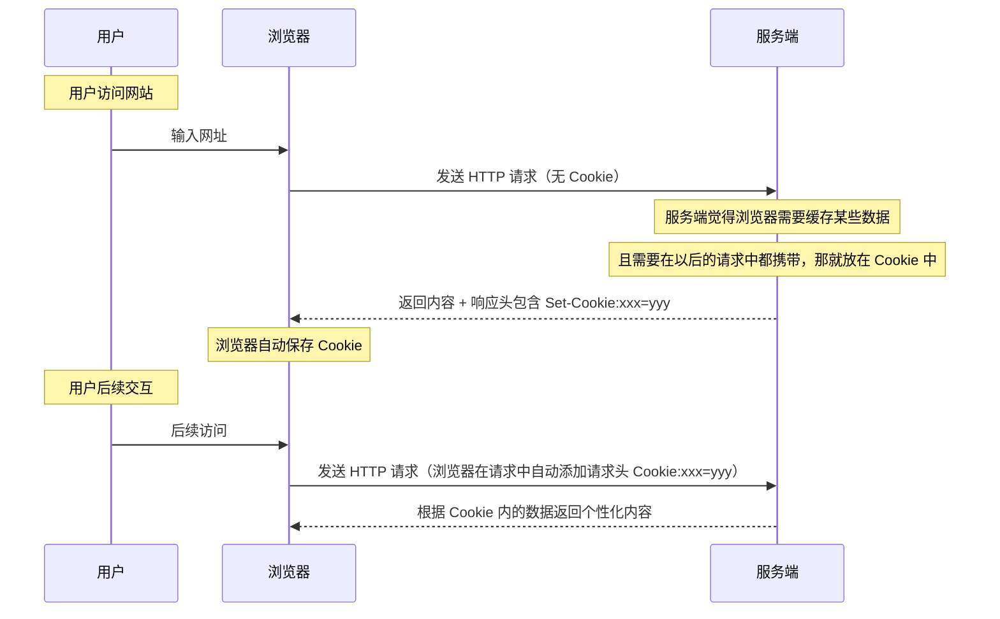

# 深入解析 Cookie：从起源到实践指南

从事现代网络开发，不可避免会听说过 `Cookie`，但很多人都没有系统了解过。本文将由浅入深的带大家理解 Cookie 的作用和使用。

## Cookie 的起源

你可能知道 Cookie 是浏览器中用来存储一些数据的，但是你知道为什么需要 Cookie 吗?

Cookie 的概念最早由网景公司（Netscape）在 1994 年提出，旨在弥补 HTTP 协议的无状态特性。HTTP 是一种无状态协议，也就是说每次请求都是独立的，无法记住前一次的交互。为了实现会话管理，网景引入了 Cookie 机制，使得服务器可以指定在客户端存储少量数据，在下一次发送请求时，自动将这些数据带上，从而实现“记住前一次的交互”，也就是维持会话状态。

到这里，你可能对 Cookie 没有特别形象的理解，下面通过时序图直观地展示 Cookie 被使用的流程以及其在交互过程中的作用。

## Cookie 的使用流程

下图展示了 Cookie 数据的产生到“被后续请求使用”的全流程：



1. Cookie 的来源：浏览器存储的 Cookie 内容是由服务端返回的，也就是说服务端觉得某些数据需要在后面的请求中携带时，就会将这种数据放在响应头的 Set-Cookie 中。

	当浏览器发现响应的 Header 中有 Set-Cookie 字段时，就会自动将其内容存储到浏览器的 Cookie 区域中。
   
	响应头可以同时包含多个 Set-Cookie：

	```
	HTTP/1.1 200 OK
	Content-Type: text/html
	Set-Cookie: sessionId=abc123; Path=/; HttpOnly
	Set-Cookie: theme=light; Path=/; Secure
	Set-Cookie: lang=en-US; Path=/; SameSite=Lax
	```

2. 浏览器会自动将 Cookie 填充到后续请求的 Header 中：如果有多个 Cookie，则逗号分隔拼接起来

	```
	Cookie:sessionId=abc123,theme=light,lang=en-US
	```
	
	浏览器自动为每个请求添加符合以下条件的所有 Cookie：

	- **Domain 匹配**：Cookie 的 `Domain` 属性与请求的域名完全匹配，或为其父域名，也就是说父域名的 Cookie 会被添加到对子域名的请求上。
	- **Path 匹配**：请求路径位于 Cookie 的 `Path` 指定的路径或其子路径下。
	- **未过期**：当前时间在 Cookie 的有效期内。
	- **Secure 属性**：如果 Cookie 设置了 `Secure`，仅在 HTTPS 请求中发送。
	- **SameSite 属性**：根据 `SameSite` 属性，决定是否在跨站请求中发送 Cookie。


## Cookie 的基本结构

| 属性名称     | 描述       | 示例                                    | 作用                                           |
| ------------ | ----------------------------------- | ---------------------------- | ------------------ |
| **Name**     | Cookie 的名称，用于标识 Cookie 的唯一性。                           | `sessionId`                             | 识别和区分不同的 Cookie。                      |
| **Value**    | Cookie 存储的数据内容。                                             | `abc123`                                | 存储会话信息或用户偏好设置。                   |
| **Expires**  | 指定 Cookie 的过期日期（GMT 时间），超过此时间 Cookie 将被删除。    |`Expires=Wed, 09 Jun 2023 10:18:14 GMT` | 控制 Cookie 的生命周期，适用于长期存储。       |
| **Max-Age**  | 指定 Cookie 的存活时间（以秒为单位），根据时间长度自动删除 Cookie。 | `Max-Age=3600`                          | 适用于短期存储，控制 Cookie 的生命周期。       |
| **Domain**   | 指定 Cookie 适用的域名，可以是当前域名或其子域名。                  | `Domain=example.com`                    | 控制 Cookie 的适用范围，跨子域名共享 Cookie。  |
| **Path**     | 指定 Cookie 适用的路径，只有在匹配路径及其子路径的请求中发送。      | `Path=/`                                | 精细控制 Cookie 的发送范围，提升安全性和性能。 |
| **Secure**   | 指示 Cookie 仅在 HTTPS 连接中传输，增加安全性。                     |`Secure`                                | 增强 Cookie 的安全性，防止在不安全连接中泄露。 |
| **HttpOnly** | 禁止 JavaScript 访问 Cookie，防止 XSS 攻击。                        |  `HttpOnly`                              | 增加 Cookie 的安全性，防止通过脚本窃取。       |
| **SameSite** | 控制 Cookie 在跨站请求中的发送行为，防止 CSRF 攻击。取值： `Strict`、`Lax`、`None` | `SameSite=Lax`                          | 提升安全性，减少跨站攻击风险。                 |


**完整示例：**

```http
Set-Cookie: sessionId=abc123; Expires=Wed, 09 Jun 2023 10:18:14 GMT; Path=/; Domain=example.com; Secure; HttpOnly; SameSite=Lax
```

在上面的例子中，各个属性以分号分隔：

- `sessionId` 是 Cookie 的名称，`abc123` 是其值。
- `Expires` 指定了 Cookie 的过期时间。
- `Path` 指定了 Cookie 的作用路径为网站根目录 `/`。
- `Domain` 指定了适用的域名为 `example.com`。
- `Secure` 表示该 Cookie 仅在 HTTPS 连接中发送。
- `HttpOnly` 防止客户端脚本访问该 Cookie。
- `SameSite=Lax` 表示在跨站请求时有条件地发送该 Cookie。


## Cookie 和 LocalStorage 的区别

 Cookie 和 LocalStorage 都可以存储数据，那它们之间有什么区别呢，以下是它们的对比表，概述了它们在多个维度上的主要区别：

| **特性**         | **Cookie**                                                                                                 | **LocalStorage**                                                                                   |
| ---------------- | ---------------------------------------------------------------------------------------------------------- | -------------------------------------------------------------------------------------------------- |
| **存储大小**     | 取决于浏览器，一般每个域名限制 20-50 个 Cookie，每个 Cookie 限制约 4KB                                     | 取决于浏览器，一般每个域名限制约 5MB，无数量限制                                                   |
| **过期机制**     | 可设置有效期（过期时间）或为会话 Cookie                                                                    | 数据**永久保存**，除非显式删除                                                                     |
| **发送方式**     | **自动发送到服务器，每次 HTTP 请求都会包含**                                                               | **不会自动发送到服务器，仅通过 JavaScript 访问**                                                   |
| **用途**         | 主要用于用户身份验证、会话管理、跟踪用户行为                                                               | 适合存储客户端应用数据、用户偏好等                                                                 |
| **跨域共用**     | 只能在设置了相同域名的情况下访问                                                                           | 只能在同一源（协议、域名和端口号相同）下存取                                                       |
| **安全性**       | 支持 HttpOnly 和 Secure 属性，增强安全性                                                                   | 不支持 HttpOnly，存在 XSS 攻击风险                                                                 |
| **使用API**      | 基于 HTTP协议，操作相对繁琐                                                                                | API 简单易用，通常是 key-value 存储                                                                |
| **数据读取速度** | 较快（但每次请求均需包含）                                                                                 | 极快，特别是当数据量较大时                                                                         |
| **适用场景**     | 适用于存储短期、需与服务器频繁交互的小型数据，尤其是与用户身份验证、会话管理、个性化设置和安全相关的数据。 | 适用于存储大容量的、客户端使用的数据，尤其是在需要持久化存储并且不需要与服务器频繁交互的缓存数据。 |

通过这个表格，可以直观地看出：虽然二者都可以存储数据，但是它们各自具有特殊的属性，以至于它们分别适用于不同的场景，可以根据实际需求选择合适的方式。

例如：浏览器经常需要存储 JWT 令牌，用于作为后续请求的身份标识。作为开发者，你把它存在 Cookie 或 LocalStorage 中都行，只要后续请求时，能把它取出来，加在请求中就行。这两种方式的区别无非就是：Cookie 可以自动携带，LocalStorage 需要手动取出来携带、Cookie 可以设置一些安全属性，LocalStorage 不能设置安全属性，最终的结果就是“**功能实现上都一样，但是安全性或者什么东西上有些差别，而你如果不在乎这个，那就无所谓了，有个地方存就行**”。

⚠️ **安全提示**：**不要在 Cookie 中存储敏感信息**（如密码、信用卡号）。Cookie 通常以明文形式存储，易受攻击。


## Cookie 如何影响网站性能?

尽管 Cookie 提供了许多便利，但不合理的使用可能对网站性能产生负面影响。以下是主要的影响和优化建议：


### Cookie 对性能的负面影响

#### 1.增加请求大小

每次 HTTP 请求都会携带相应域名下的所有符合条件的 Cookie。如果 Cookie 过多或过大，会显著增加请求头的大小，导致网络传输数据量增加，影响加载速度。

**示例：**

如果 `example.com` 设置了4个大小为 4KB 的 Cookie，那么每个针对 `example.com` 的资源请求（如图片、CSS、JS 等）都会附带这些 Cookie，导致每个请求头额外增加 16KB。

#### 2.影响缓存效率

当静态资源（如图片、CSS、JS 文件）的请求携带 Cookie 时，可能导致代理服务器或 CDN 无法正确缓存这些资源。这是因为具有不同 Cookie 的请求被视为不同的请求，导致资源无法有效复用，增加了服务器负担和加载时间。

#### 3.安全与资源消耗

| 问题类型     | 描述                                                                                   |
| ------------ | -------------------------------------------------------------------------------------- |
| **安全风险** | 不当设置的 Cookie 可能被截获或篡改，导致安全漏洞，如会话劫持。                         |
| **资源消耗** | 浏览器在处理大量 Cookie 时，会消耗更多的内存和计算资源，特别是在资源受限的移动设备上。 |

### Cookie 的优化建议

为最大限度地减少 Cookie 对性能的负面影响，建议采取以下优化措施：

#### 1.精简 Cookie 内容

- **仅存储必要的信息**，避免冗余数据占用空间。
- **使用短名称和简短的值**，减少单个 Cookie 的大小。

#### 2.设置合适的作用域

因为父域名的 Cookie 会被添加到对子域名的请求中，所以对于子域名来说，可能会多出一些不必要 Cookie。

- **限制 Domain 和 Path**：通过 `Domain` 和 `Path` 限制 Cookie 的生效范围，避免在不必要的请求中携带 Cookie。
- **子域名隔离**：将静态资源放在独立的子域名下（如 `static.example.com`），避免设置 Cookie，减少请求头大小。

#### 3.使用合适的存储方式

对于需要在客户端存储大量或复杂数据的情况，考虑使用 `localStorage`、`sessionStorage` 或 `IndexedDB`，这些存储方式具有更大的容量限制，并且不会被自动添加到每次 HTTP 请求中。

#### 4.合理设置 Cookie 属性

- **HttpOnly**：防止客户端脚本访问 Cookie，提升安全性。
- **Secure**：确保 Cookie 仅在 HTTPS 连接中传输，防止中间人攻击。
- **SameSite**：防止跨站请求伪造（CSRF）攻击，根据实际需求选择合适的策略（`Strict`、`Lax` 或 `None`）。

#### 定期清理过期 Cookie

- 通过设置合理的 `Expires` 或 `Max-Age`，确保 Cookie 不会长期占用资源。
- 实现自动或手动清理机制，删除不再使用的 Cookie。

## 总结

合理管理和优化 Cookie 不仅能提升网站性能，还能增强安全性。通过精简 Cookie 内容、设置合适的作用域和属性，以及采用合适的客户端存储方式，可以有效减少 Cookie 对网站性能的不利影响。

希望这篇文章能够帮助你全面理解 Cookie，能在实际项目中灵活运用这些知识，为用户打造更高效、安全的网页体验。

## 参考资料

1. [MDN Web 文档 - HTTP Cookies](https://developer.mozilla.org/zh-CN/docs/Web/HTTP/Cookies)
2. [RFC 6265 - HTTP State Management Mechanism](https://datatracker.ietf.org/doc/html/rfc6265)
3. [OWASP - Cookie Security](https://owasp.org/www-community/HttpOnly)
4. [GDPR 指南](https://gdpr-info.eu/)
